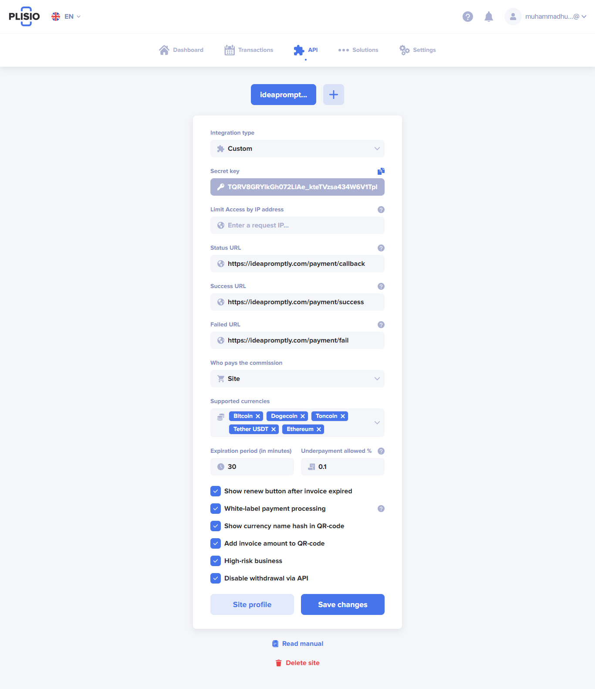
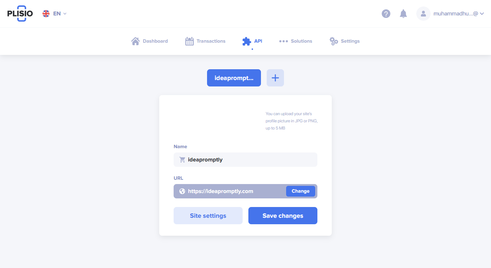

* https://github.com/Plisio/plisio-sdk-laravel
* Create account kry. account register krty howy apny wallet key mangy ge so already created wallet ki key use kro.
* goto Dashboard or My wallets pr curency Add krle

### 1. Copy Api gogo api

* Set app name ideapromptly
* Set url https://ideapromptly.com
* Copy Secret key

##### then Click See Profile and set store name url and profile

